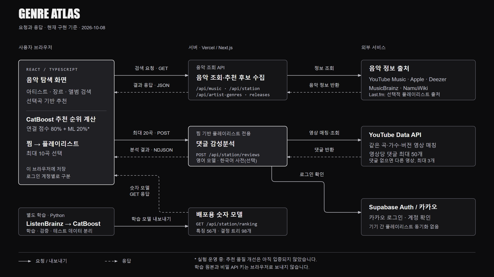

# Genre Atlas

**좋아하는 한 곡에서, 다음 음악으로.** 아티스트·장르·앨범을 탐색하고 곡의 연결 관계를 따라 새로운 음악을 발견하는 개인 프로젝트입니다.

[사이트 열기](https://project-9oimu.vercel.app/) · [발표자료 PDF](presentation/Genre_Atlas.pdf) · [구조와 요청·응답](docs/architecture.md)



## 무엇을 할 수 있나요?

| 기능 | 사용 방법 |
| --- | --- |
| **아티스트 탐색** | 아티스트 검색 → Related / Genre 전환 → 다른 가수와 앨범 탐색 |
| **곡 추천** | 곡 검색 → 정확한 버전 선택 → 제작진·샘플 연결을 우선으로 다음 곡 추천 |
| **나의 플레이리스트** | 카카오 로그인 → 곡 찜 → 찜을 바탕으로 별도의 플레이리스트 생성 |

일반 곡 추천은 로그인 없이 사용할 수 있습니다. **찜 기반 플레이리스트는 곡 추천 대기열을 재사용하지 않습니다.**

## 머신러닝은 어디에 쓰이나요?

- **곡 추천 순위:** Python으로 학습한 CatBoost 모델을 숫자 트리로 내보내 웹에서 실행합니다. 선택곡과 후보곡의 장르·길이 등 56개 특징을 비교하고, 적용 가능한 경우 기존 연결 점수 80% + 모델 점수 20%로 정렬합니다.
- **플레이리스트 선별:** 최근 찜 최대 5곡에서 후보 최대 20곡을 모은 뒤, YouTube 댓글을 분석하여 최대 10곡을 선택합니다. 영어는 사전학습 감성 모델, 한국어는 선택적으로 제공한 감성사전을 사용합니다.
- **실험 결과를 구분합니다:** CatBoost는 단순 장르 겹침 기준보다 개선됐다고 확인되지 않았습니다. 댓글 감성도 개인의 취향이나 추천 성공 확률을 뜻하지 않습니다.

[학습 데이터·평가 결과](docs/song-context-ranking.md) · [댓글 분석·예외 처리](docs/review-playlists.md)

## 로컬 실행

Node.js **22.13 이상**이 필요합니다.

```bash
npm ci
npm run dev:vercel -- --port 3113
```

브라우저에서 [localhost:3113](http://localhost:3113)을 엽니다. 배포 대상은 Next.js / Vercel이며, 기존 Sites용 실행 스크립트는 별도로 보존되어 있습니다.

선택 기능의 설정값은 커밋하지 않는 `.env.local` 또는 배포 서버 설정에 둡니다.

| 설정값 | 용도 |
| --- | --- |
| `NEXT_PUBLIC_SUPABASE_URL`, `NEXT_PUBLIC_SUPABASE_PUBLISHABLE_KEY` | 카카오 로그인 연결용 공개 클라이언트 설정 |
| `YOUTUBE_API_KEY` | 서버의 YouTube 댓글 조회 |
| `LASTFM_API_KEY` | 선택적인 유사 곡 후보 출처 |
| `SENTIMENT_LEXICON_PATH` | 선택적인 서버용 한국어 감성사전 경로 |

**YouTube 키·카카오 Client Secret·Supabase 비밀 키는 브라우저 코드나 GitHub에 넣지 않습니다.** 로그인 리디렉션 등은 [인증 설정](docs/vercel-auth.md)을 참고하세요. 외부 서비스 약관과 요청 한도도 적용됩니다.

## 검사

```bash
node scripts/test-onboarding.cjs
node scripts/test-musicbrainz-genres.cjs
node scripts/test-kakao-auth.cjs
node scripts/test-liked-playlist.cjs
node scripts/test-playlist-review-flow.cjs
npm run build:vercel
```

## 알아둘 점

- 찜·후보·플레이리스트 기록은 **로그인 계정별로 이 브라우저에 저장**됩니다. 다른 기기로 동기화하거나 YouTube에 저장하는 기능은 없습니다.
- 댓글 감성점수가 양수인 곡을 먼저 선택합니다. 정확히 매칭한 영상들의 댓글이 모두 없거나 비활성화된 경우에만 별도 **미분석 0점 예외**가 적용됩니다. 조회 오류·분석 실패·실제 중립/부정 점수와는 다릅니다.
- 후보나 통과 곡이 부족하면 10곡을 억지로 채우지 않습니다. 매일 자동 생성하는 예약 작업은 구현하지 않았습니다.
- 외부 음악 정보의 누락·차단·버전 차이가 있을 수 있습니다. 출처와 오류를 표시하며, 장르 조회는 NamuWiki 실패 시 MusicBrainz로 보완합니다.

## 코드 안내

`app/` 화면·API · `components/` 검색·추천·플레이리스트 UI · `lib/` 조회·정렬·감성분석 로직 · `models/` 배포용 숫자 모델 · `scripts/` 검사·Python 학습 · `docs/` 상세 설명

학습 원본, 개인 평가 자료, 댓글 원문, 비밀 설정과 임시 산출물은 공개 저장소에서 제외합니다.
